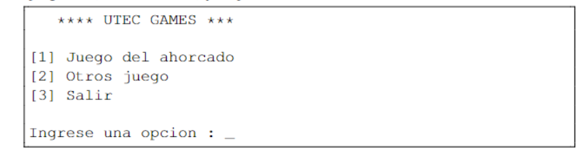
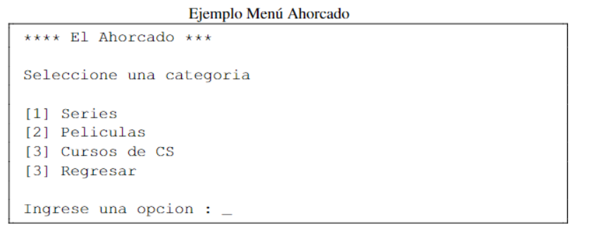
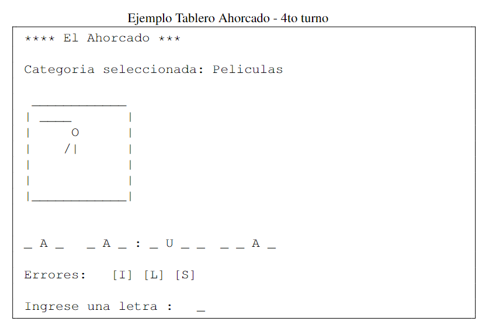

# Lista de Tareas pendientes:

- Acabar el proyecto [ ]
- Función para limpiar la consola [✔]

- El programa deberá mostrar inicialmente un menú de opciones que muestre el título del programa (UTEC GAMES) y 3 opciones [✔]

- Función para mostrar el título del juego "El ahorcado" y un menú para que el usuario seleccione la categoría o regrese al menú anterior(mínimo 5 frases o palabras por categoría) [✔]

- Función para imprimir al muñeco del ahorcado [✔]

- Función para mostrar un tablero que le permita al usuario ir seleccionando letras y adivinando la frase [✔]

- Función para que "sólo permita ingresar letras"(nada de numeros ni caracteres extraños). [✔]
- Función para que el juego termine pasados los 6 intentos. [✔]
- Función para mostrar las letras erroneas.[✔]
- Función para permitir solo una letra a la vez.[✔]
### El tablero debe mostrar estas cosas: [ ]
1. Nombre del juego
2. La categoria de la frase
3. El muñeco del ahorcado
4. La Frase a adivinar
5. las letras incorrectas
6. Apartado para ingresar letras

### Notas:
* El orden puede variar
* Debemos colocar mensajes de error amigables y concretos

